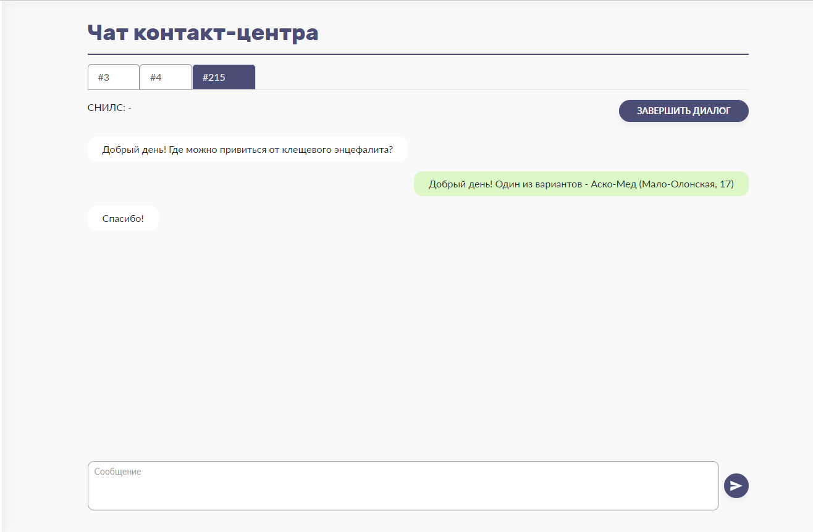
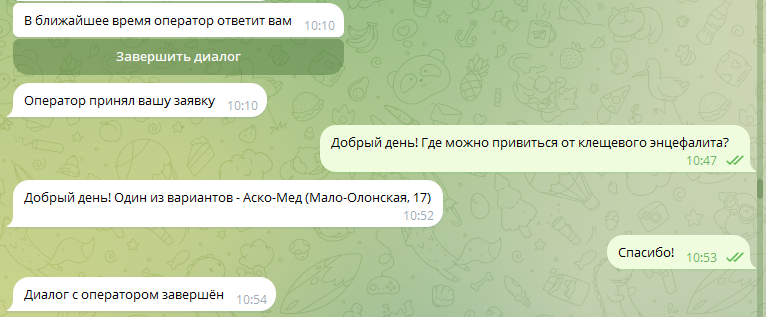

# supportBot
 Реализация телеграм-бота контакт-центра и веб-приложения диспетчера.

 
 

### Запуск приложения
Чтобы запустить приложение, нужно:
* Запустить Postgresql, создать базу данных с именем, прописанном в **env('DB_DATABASE')**
* Выполнить миграцию для создания таблиц:
```
php artisan migrate
```
* Можно также наполнить таблицы тестовыми данными, используя наполнители.
* Запустить обработчик очереди:
```
php artisan queue:work
```
* Запустить вебсокет-сервер:
```
php artisan websockets:serve
```
* Запустить сервер Redis.
* Установить вебхук в телеграм-боте, чтобы Телеграм мог присылать нам сообщения о событиях. Для этого
нужно перейти в Панель администратора.
